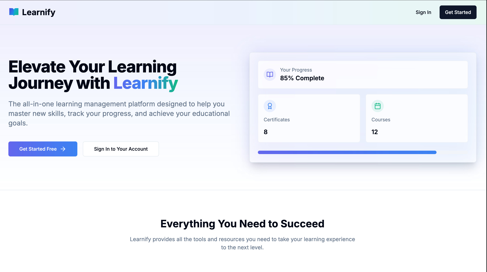
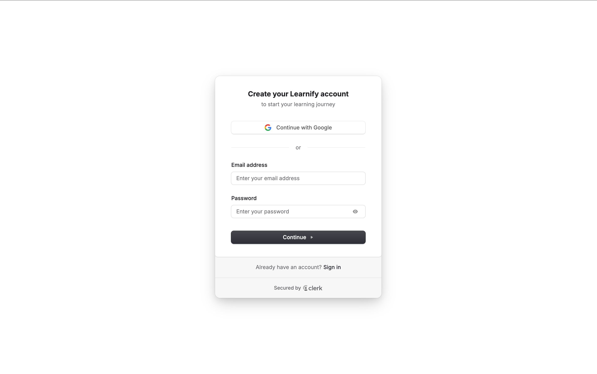
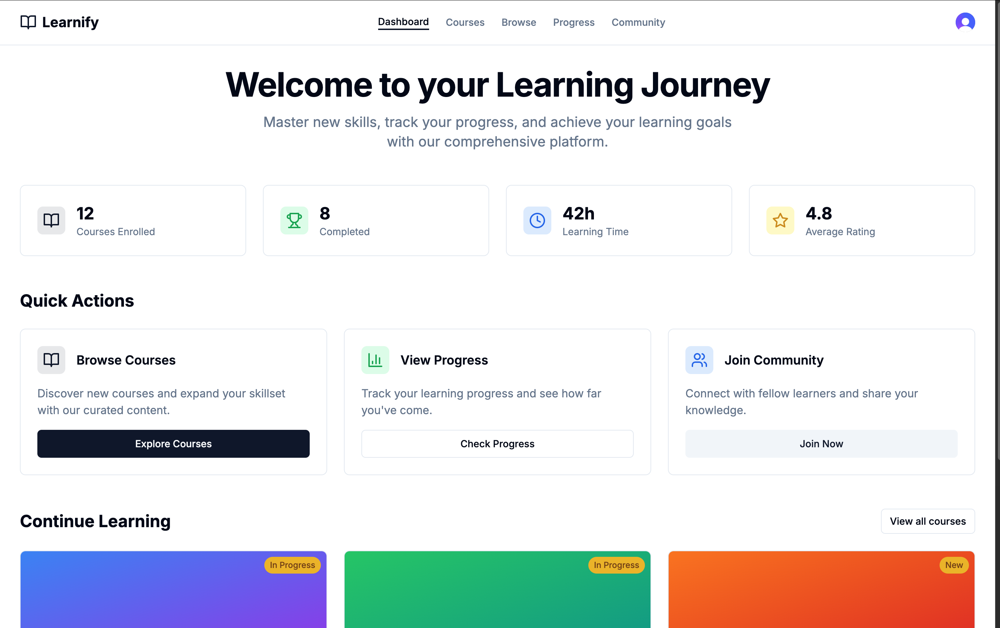
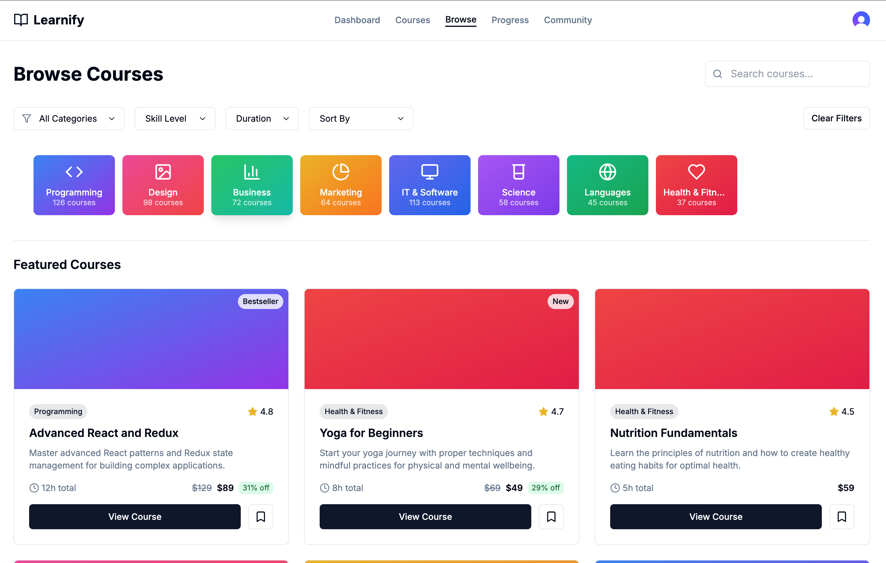
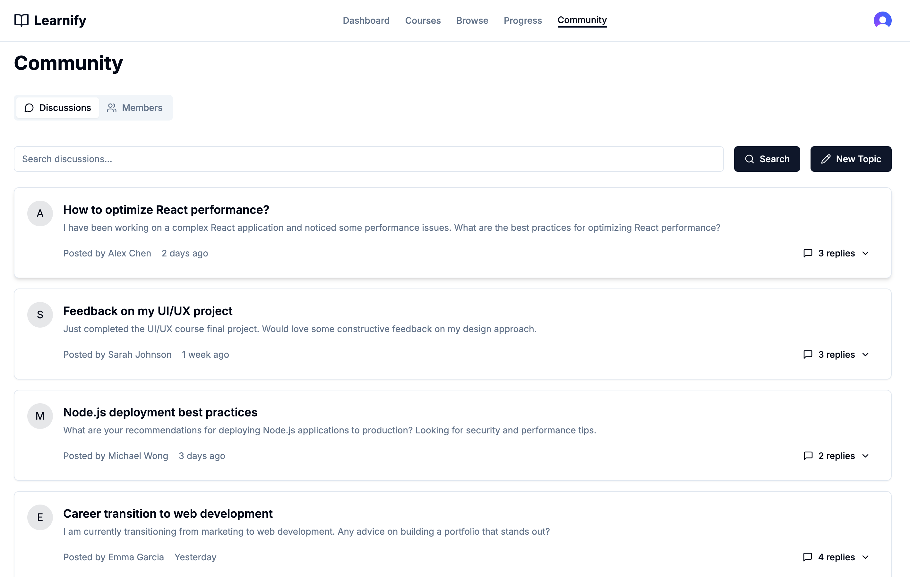
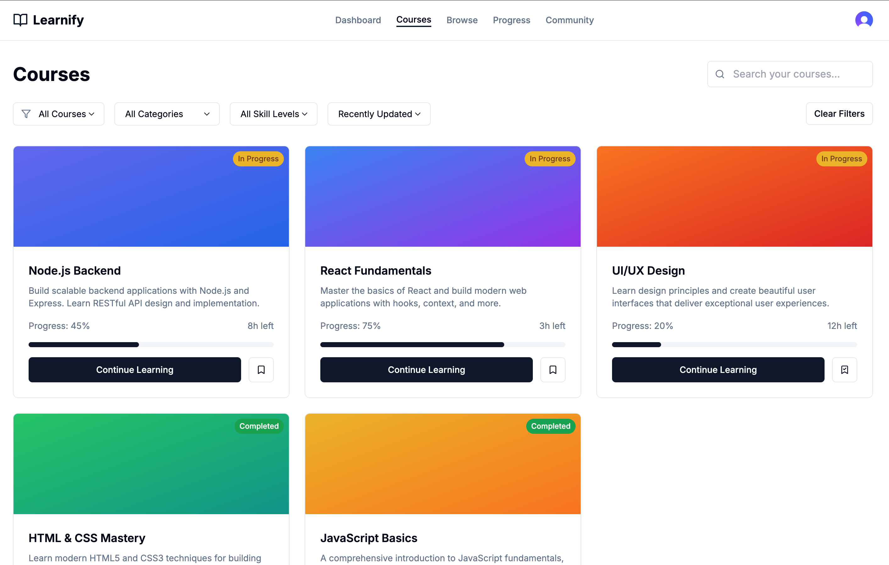
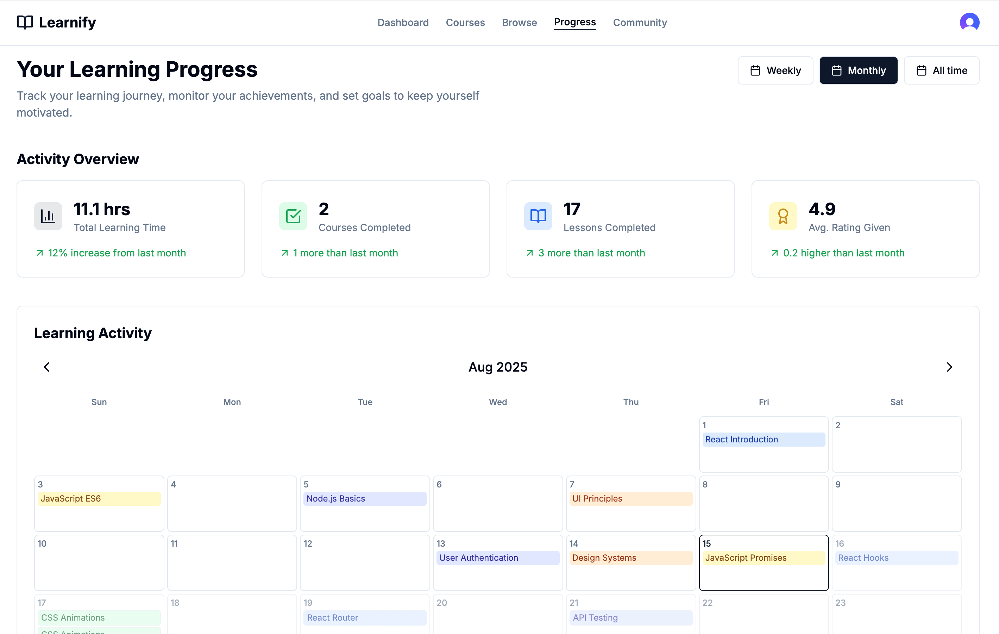

# Learnify

    

A professional-grade Learning Management System (LMS) built with modern web technologies. Learnify is designed to provide a seamless and secure learning experience for users, featuring robust authentication, interactive course management, and comprehensive progress tracking.

---

## Website Pages

### Landing Page
<div align="center">
  
</div>
<p>The main entry point to Learnify, showcasing its features and inviting users to sign up or log in.</p>

### Sign-Up Page
<div align="center">
  
</div>
<p>Allows new users to create an account and start their learning journey.</p>

### Dashboard
<div align="center">
  
</div>
<p>Provides an overview of the user's enrolled courses, progress, and quick access to resume learning.</p>

### Browse Courses
<div align="center">
  
</div>
<p>Displays a catalog of available courses, allowing users to explore and enroll in new learning opportunities.</p>

### Community Page
<div align="center">
  
</div>
<p>Engage with other learners through discussions, Q&A, and resource sharing.</p>

### Courses Page
<div align="center">
  
</div>
<p>Detailed information about individual courses, including curriculum and learning objectives.</p>

### Progress Page
<div align="center">
  
</div>
<p>Track your learning progress with visual indicators and detailed analytics.</p>

---

## Features

### Authentication
- **Email/Password Login**: Secure credential-based sign-in.
- **Google Authentication**: Easy login with Google accounts.
- **Password Reset**: Secure password recovery via email.
- **Session Management**: Track and manage active sessions across devices.
- **Two-Factor Authentication (2FA)**: Enhanced account security.

### Dashboard
- **Course Overview**: View enrolled courses and progress.
- **Progress Tracking**: Visual indicators for course completion.
- **Quick Access**: Resume learning from where you left off.

### Course Management
- **Course Catalog**: Browse and filter available courses.
- **Dynamic Course Pages**: Detailed course information and curriculum.
- **Learning Paths**: Structured learning sequences.

### Community Features
- **Discussion Forums**: Engage with other learners.
- **Q&A**: Ask and answer questions.
- **Resource Sharing**: Share learning materials.

### Security
- **Protected Routes**: Middleware ensures only authenticated users access sensitive pages.
- **IP and Device Tracking**: Monitor login activity for suspicious behavior.
- **Content Security Policies**: Prevent unauthorized access and attacks.

---

## How It Works

Learnify is a full-stack web application leveraging the following technologies:
- **Next.js**: For server-side rendering and file-based routing.
- **TypeScript**: Ensures type safety and better developer experience.
- **Tailwind CSS**: Provides utility-first styling for rapid UI development.
- **Clerk**: Handles authentication and user management.
- **Node.js**: Backend runtime for server-side logic.

---

## Setup Instructions

1. **Clone the Repository**:
   ```bash
   git clone https://github.com/jjacobsonn/lms-framework.git
   cd lms-framework
   ```

2. **Install Dependencies**:
   ```bash
   npm install
   ```

3. **Configure Environment Variables**:
   - Copy the example environment file:
     ```bash
     cp .env.example .env.local
     ```
   - Update `.env.local` with your Clerk API keys and other required configurations.

4. **Run the Development Server**:
   ```bash
   npm run dev
   ```
   The application will be available at `http://localhost:3000`.

---

## Libraries and Tools Used

- **Next.js**: Framework for React applications.
- **TypeScript**: Static typing for JavaScript.
- **Tailwind CSS**: Utility-first CSS framework.
- **Clerk**: Authentication and user management.
- **React**: Component-based UI library.
- **PostCSS**: CSS processing.

---

## Disclaimer

This project is provided "as is" without any warranty. Use at your own risk. The authors are not responsible for any issues or damages arising from the use of this software.

---

## Future Enhancements

- **Mobile Apps**: Native iOS and Android applications.
- **Advanced Analytics**: Detailed learning insights.
- **Content Creation Tools**: Enable instructors to create and manage courses.
- **Certification**: Issue certificates upon course completion.

---

## Why This Project Was Created

Learnify was developed as a hands-on project to deepen the understanding of building a modern, functional login system that is both frontend-friendly and mobile-responsive. The goal was to create a seamless user experience while integrating essential features such as:

- **Email Notifications**: Automated email notifications for user registration and password resets, ensuring a smooth onboarding and account recovery process.
- **Clerk Integration**: Leveraging Clerk for secure and scalable authentication, including social logins and session management.
- **Mobile-Friendly Design**: Ensuring the application is fully responsive and accessible across devices, providing a consistent experience for all users.

This project serves as a learning platform to explore best practices in authentication, user management, and responsive design while maintaining a focus on usability and security.

---

## License

This project is licensed under the MIT License. See the LICENSE file for details.
